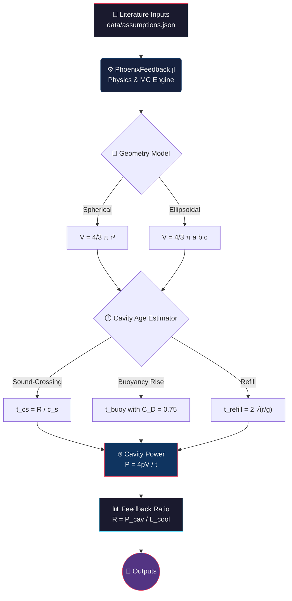
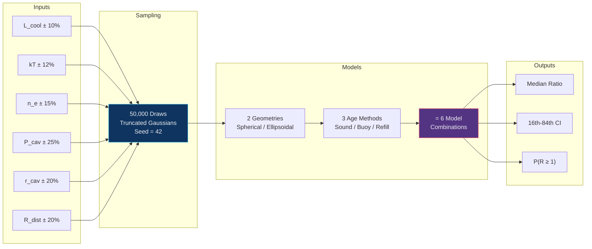
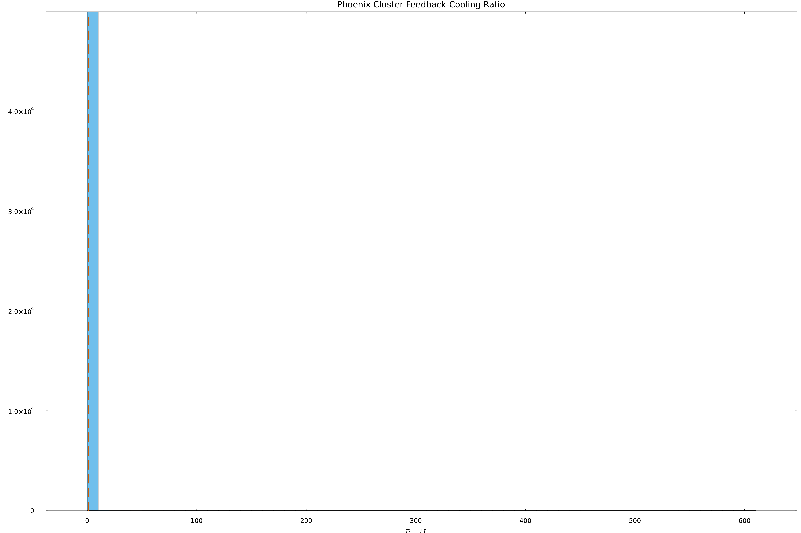
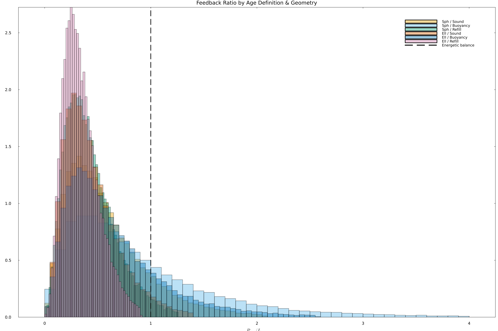
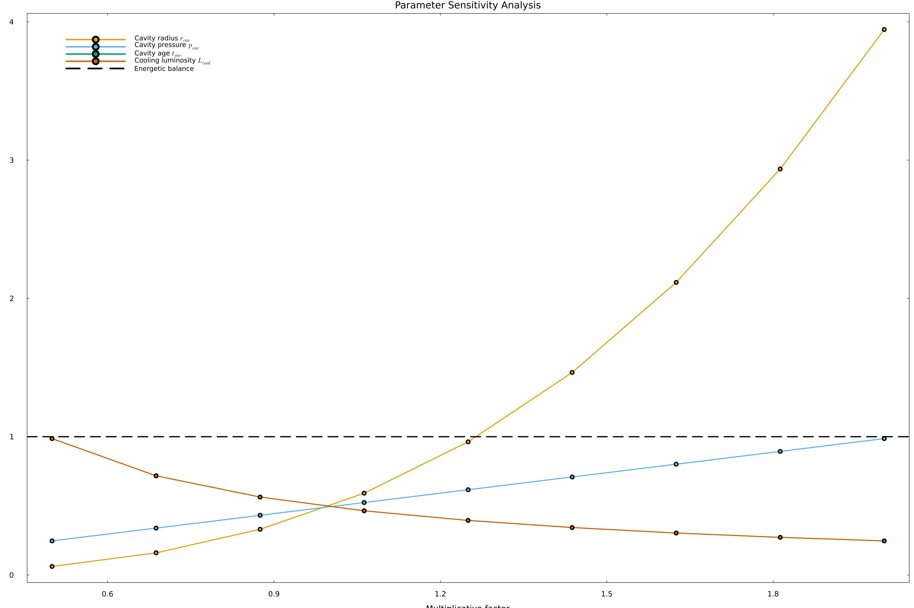
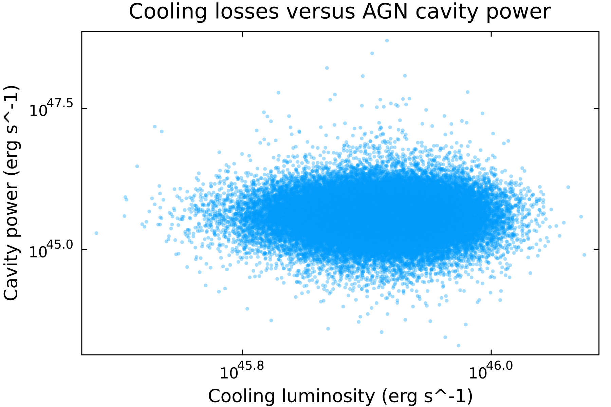
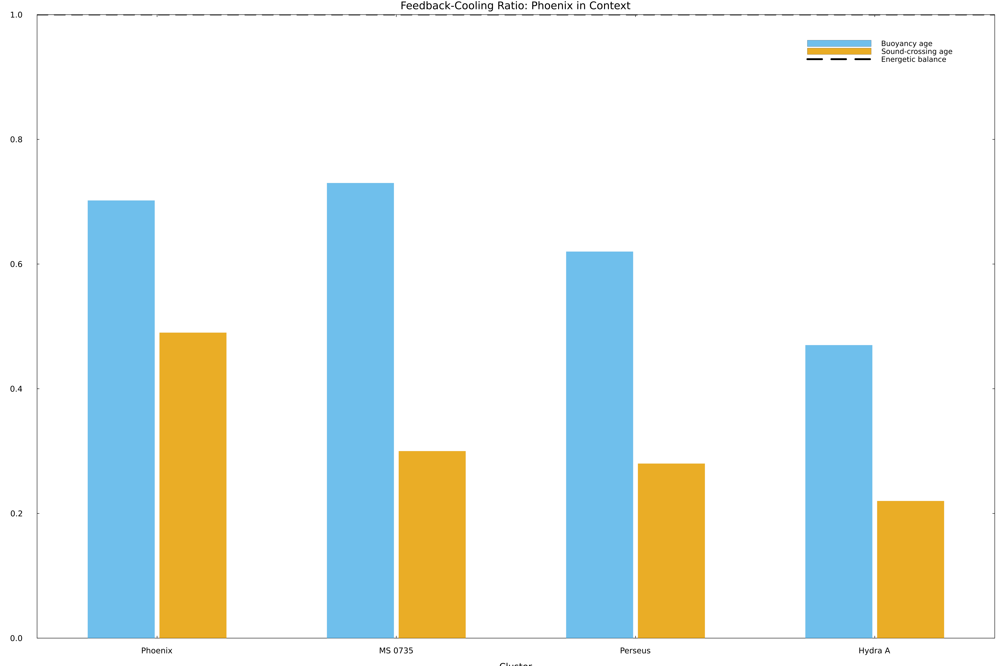
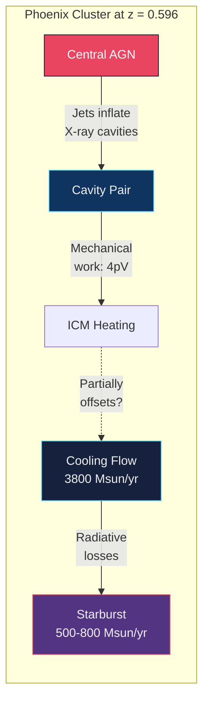
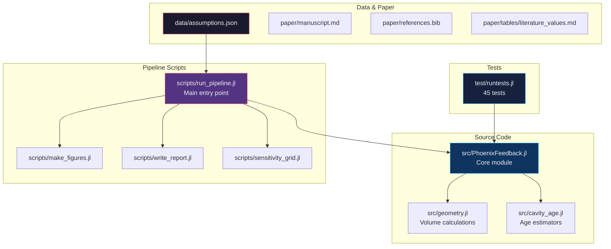

# Phoenix Cluster Feedback

[](LICENSE)
[](https://julialang.org)
[](#key-results)
[](#reproducibility)

Reproducible Julia pipeline for evaluating whether AGN mechanical feedback in
the Phoenix Cluster (SPT-CL J2344-4243, z = 0.596) is energetically consistent with
offsetting its extreme radiative cooling flow. Built with literature-anchored
measurements, full uncertainty propagation, and transparent provenance tracking.

---

## Scientific Question

> **Is the central AGN feedback power in the Phoenix Cluster energetically
> comparable to the extreme cooling flow in its core?**

The Phoenix Cluster hosts the most extreme known cooling flow in the universe
(~3800 M☉/yr classical rate; McDonald et al. 2012), a massive starburst
(500-800 M☉/yr), and a powerful central AGN with X-ray cavities. This pipeline
quantifies whether the mechanical energy stored in those cavities can offset the
radiative losses.

---

## Pipeline Architecture



## Monte Carlo Methodology



---

## Key Results

### Summary Table

| Model | Geometry | Age Method | Median Ratio | 16th pctl | 84th pctl | P(≥1) |
|-------|----------|------------|:------------:|:---------:|:---------:|:-----:|
| **Sph / Sound** | Spherical | Sound-crossing | 0.490 | 0.231 | 0.944 | 13.8% |
| **Sph / Buoyancy** | Spherical | Buoyancy rise | **0.702** | 0.293 | 1.523 | **33.0%** |
| **Sph / Refill** | Spherical | Refill | 0.386 | 0.203 | 0.666 | 3.4% |
| **Ell / Sound** | Ellipsoidal | Sound-crossing | 0.386 | 0.202 | 0.692 | 4.7% |
| **Ell / Buoyancy** | Ellipsoidal | Buoyancy rise | 0.532 | 0.251 | 1.062 | 18.4% |
| **Ell / Refill** | Ellipsoidal | Refill | 0.317 | 0.183 | 0.516 | 0.5% |

> **Conclusion:** Phoenix Cluster cavity power is comparable to the cooling
> luminosity but remains below unity for most standard age/geometry assumptions,
> suggesting that cavities alone may not fully offset cooling unless additional
> heating channels contribute.

### Feedback Ratio Distribution (Single-Age, Spherical)

Distribution of the feedback-to-cooling power ratio from the legacy single-age
spherical Monte Carlo (N = 50,000). The dashed line marks the ratio = 1
balance point.



### Multi-Age Ratio Comparison

Comparison of feedback-to-cooling ratios across all six model configurations.
The buoyancy-rise estimator consistently produces the highest ratios, while
ellipsoidal geometry reduces all estimates by ~20-25%.



### Parameter Sensitivity Analysis

One-at-a-time sensitivity scan showing how the feedback ratio responds to
perturbations in each input parameter. Cavity radius (cubic volume dependence)
and cavity age (inverse dependence) dominate the uncertainty budget.



### Cooling Luminosity vs Cavity Power

Scatter plot of cooling luminosity versus computed cavity power for individual
Monte Carlo samples (log-log scale), illustrating the correlation structure.



### Cluster Comparison

Feedback-cooling ratio comparison across four well-studied cool-core clusters
(Phoenix, MS 0735, Perseus, Hydra A) for buoyancy-age and sound-crossing-age
estimates. Phoenix's ratio is comparable to MS 0735 under buoyancy-age
assumptions but its extreme absolute cooling rate makes the residual cooling
far more significant.



---

## Physical Context



The Phoenix Cluster occupies a unique position in the cooling-flow landscape:

- **Cooling rate:** Classical mass deposition rate of ~3800 M☉/yr (McDonald et al. 2012)
- **Star formation:** 500-800 M☉/yr in the BCG, the highest known for any cluster
- **Molecular gas:** ~2 x 10¹⁰ M☉ detected in CO(3-2) by ALMA (Russell et al. 2017)
- **AGN cavities:** A pair of radio-filled X-ray cavities detected by Chandra (McDonald et al. 2015)

---

## Installation

### Prerequisites
- [Julia 1.10+](https://julialang.org/downloads/) (tested on Julia 1.12.6)

### Setup

```bash
# Clone the repository
git clone https://github.com/phanendra09/phoenix-cluster-feedback.git
cd phoenix-cluster-feedback

# Install dependencies
julia --project=. -e 'using Pkg; Pkg.instantiate()'

# Run tests
julia --project=. test/runtests.jl
```

## Usage

### Quick Mode (2,000 samples, ~30 seconds)
```bash
julia --project=. scripts/run_pipeline.jl --quick
```

### Full Mode (50,000 samples, ~3 minutes)
```bash
julia --project=. scripts/run_pipeline.jl --full
```

### Reproducible Run with Explicit Seed
```bash
julia --project=. scripts/run_pipeline.jl --full --seed 42
```

---

## Outputs

| File | Description |
|------|-------------|
| `results/feedback_summary.json` | Legacy single-age summary statistics |
| `results/multi_age_summary.json` | Multi-age, multi-geometry summary |
| `results/monte_carlo_samples.csv` | Legacy MC samples |
| `results/multi_age_samples.csv` | Full MC samples (6 ratio columns) |
| `results/sensitivity_grid.csv` | Sensitivity analysis grid |
| `results/derived_quantities.csv` | Derived physics audit table |
| `results/run_metadata.json` | Reproducibility metadata (seed, Julia version, timestamp) |
| `results/feedback_report.md` | Human-readable report |
| `figures/*.png` | Publication-quality plots |
| `figures/*.pdf` | Vector plots for LaTeX inclusion |

## Reproducibility

Every pipeline run generates `results/run_metadata.json` containing:

```json
{
    "run_mode": "full",
    "sample_count": 50000,
    "seed": 42,
    "julia_version": "1.12.6",
    "timestamp_utc": "2026-04-30T16:21:57.102",
    "assumption_file_path": "data/assumptions.json",
    "assumption_file_sha256": "2c2838..."
}
```

---

## Project Structure



```text
src/
  PhoenixFeedback.jl       Core module: physics, MC, sensitivity
  geometry.jl              Spherical and ellipsoidal cavity volumes
  cavity_age.jl            Sound-crossing, buoyancy, refill ages
scripts/
  run_pipeline.jl          End-to-end reproducible run (--quick / --full / --seed)
  make_figures.jl          Publication-quality figure generation
  sensitivity_grid.jl      Standalone sensitivity analysis
  write_report.jl          Markdown report generation
data/
  assumptions.json         Cited input assumptions with aperture metadata
  literature_targets.csv   Citation tracking checklist
paper/
  manuscript.md            Journal manuscript (ApJ/MNRAS ready)
  references.bib           BibTeX database (15 entries)
  tables/                  Literature comparison & citation audit tables
  notes.md                 Working notes & status checklist
test/
  runtests.jl              45-test suite covering physics, geometry, and MC
```

---

## Cavity Age Formulas

The three independent cavity age estimators implemented in this pipeline:

| Estimator | Formula | Reference |
|-----------|---------|-----------|
| **Sound-crossing** | t_cs = R / c_s, where c_s = √(γ kT / μ m_p) | Birzan et al. (2004), Eq. 2 |
| **Buoyancy rise** | t_buoy = R √(S C_D / 2gV), with C_D = 0.75 | Churazov et al. (2001); Birzan et al. (2004), Eq. 3 |
| **Refill** | t_refill = 2 √(r / g) | McNamara & Nulsen (2007) |

---

## Key References

| Paper | Topic | Used For |
|-------|-------|----------|
| McDonald et al. (2012), *Nature* 488, 349 | Discovery paper | Cooling luminosity, SFR, redshift |
| McDonald et al. (2015), *ApJ* 811, 111 | Cavity detection | Cavity radius, distance, age |
| McDonald et al. (2019), *ApJ* 885, 63 | Deprojected profiles | Temperature, density profiles |
| Hlavacek-Larrondo et al. (2015), *ApJ* 805, 35 | SPT cavity survey | Ellipsoidal dimensions |
| Russell et al. (2017), *ApJ* 836, 130 | ALMA molecular gas | Physical context |
| Birzan et al. (2004), *ApJ* 607, 800 | Cavity methodology | Age formulas, ellipsoidal convention |
| McNamara & Nulsen (2007), *ARA&A* 45, 117 | AGN feedback review | Refill time formula |
| Churazov et al. (2001), *ApJ* 554, 261 | Buoyancy formulation | Drag coefficient |

---

## Citation

If you use this pipeline in your research, please cite:

```bibtex
@software{phoenix_feedback_2026,
  title  = {Phoenix Cluster AGN Feedback Pipeline},
  author = {Phanendra},
  url    = {https://github.com/phanendra09/phoenix-cluster-feedback},
  year   = {2026}
}
```

## License

This project is licensed under the [MIT License](LICENSE).
